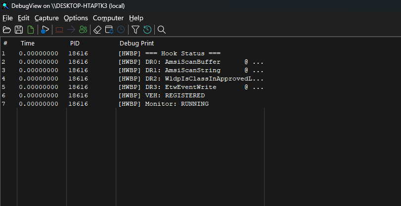

# HWBP Engine — AMSI / WLDP / ETW Bypass via Hardware Breakpoints

**A security-research Proof-of-Concept (POC) demonstrating hardware-breakpoint (CPU debug register) based function hooking as an alternative to traditional in-memory code patching.**

> **Purpose & Scope**
>
> This repository is published **strictly for defensive security research, red-team/purple-team education, detection engineering, and academic study** of Windows internals. It demonstrates *how* an attacker could abuse processor debug registers to neutralize user-mode security telemetry — and, equally important, *what defenders should monitor for* in order to detect such techniques. The author is **not** responsible for any misuse of this code. Usage of this technique against systems without explicit authorization is illegal and violates the relevant computer-fraud and abuse laws in most jurisdictions. **Do not deploy this in any environment you do not own or have explicit written permission to test.**

---

## Table of Contents

1. [Overview](#overview)
2. [Background — Why Hardware Breakpoints?](#background--why-hardware-breakpoints)
3. [Targeted Security Components](#targeted-security-components)
4. [Architecture](#architecture)
5. [Technical Deep Dive](#technical-deep-dive)
   - [5.1 Hardware Breakpoints on x64](#51-hardware-breakpoints-on-x64)
   - [5.2 Debug Register Layout (DR0–DR7)](#52-debug-register-layout-dr0dr7)
   - [5.3 The Vectored Exception Handler (VEH)](#53-the-vectored-exception-handler-veh)
   - [5.4 Per-Component Interception Logic](#54-per-component-interception-logic)
   - [5.5 Thread Management & Hook Persistence](#55-thread-management--hook-persistence)
6. [Exported API](#exported-api)
7. [Build Instructions](#build-instructions)
8. [Injection & Usage Example](#injection--usage-example)
9. [Detection & Mitigation (Blue Team)](#detection--mitigation-blue-team)
10. [Known Limitations](#known-limitations)
11. [References](#references)

---

## Overview

`mora_hwbp.c` implements a DLL that, once loaded/injected into a target process (e.g., a PowerShell host), hooks **four** user-mode functions **exclusively through CPU hardware breakpoints** stored in the architectural debug registers (`DR0`–`DR7`) of every thread in the process:

| Register | Hooked Function     | Module  | Purpose                                   |
|----------|---------------------|---------|-------------------------------------------|
| `DR0`    | `AmsiScanBuffer`    | `amsi.dll` | Neutralize AMSI content scanning        |
| `DR1`    | `AmsiScanString`    | `amsi.dll` | Neutralize AMSI string scanning         |
| `DR2`    | `WldpIsClassInApprovedList` | `wldp.dll` | Force WLDP class approval (Device Guard / WDAC) |
| `DR3`    | `EtwEventWrite`     | `ntdll.dll` | Suppress ETW event tracing             |

A per-process **Vectored Exception Handler (VEH)** receives the `EXCEPTION_SINGLE_STEP` (0x80000004) faults raised by the debug registers, simulates the original function's *successful* return path by rewriting the exception context, and resumes execution — all **without modifying a single byte of executable memory**.

This makes the technique particularly interesting from both offensive and defensive perspectives:

- **Offensively**, it bypasses EDR/HIPS integrity checks that look for modified `.text` sections (classic inline hooking, `EAT`/`IAT` patching, or `Etwp*` stubbing).
- **Defensively**, hardware breakpoints leave highly distinctive forensic artifacts (debug-register contents, single-step exception density, VEH registration, `GetThreadContext`/`SetThreadContext` syscall patterns) that can be used for detection.

---

## Background — Why Hardware Breakpoints?

Traditional user-mode hooking approaches — inline detours (5–14 byte overwrites), import address table (IAT) hooking, and export address table (EAT) hooking — share a common weakness: **they modify memory that integrity scanners and ETW can observe.**

Modern AV/EDR products implement:

- **Memory scanning / AMSI scans** of PowerShell and .NET CLR buffers;
- **ETW-based telemetry** (Microsoft-Windows-PowerShell, .NET ETW, threat intelligence providers);
- **Kernel callbacks and user-mode integrity checks** that detect `pageguard`/`guard-page` tricks, `VirtualProtect` transitions to `PAGE_EXECUTE_READWRITE`, and section hash mismatches.

Hardware breakpoints sidestep all of this:

1. They are **CPU registers**, not memory — there is nothing to scan in `.text`.
2. They are set on a **per-thread** basis via the Windows API `SetThreadContext`, which does **not** trigger the classic "memory modified" signals used by integrity scanners.
3. The interception point is handled entirely by the **processor's exception dispatch**, which routes through the process VEH chain before any user-mode target function executes.

This POC explores the efficacy and detectability of this technique against **AMSI (Antimalware Scan Interface)**, **WLDP (Windows Lockdown Policy)**, and **ETW (Event Tracing for Windows)** — the three most widely relied-upon user-mode security primitives in the modern Windows security stack.

---

## Targeted Security Components

### AMSI — Antimalware Scan Interface

AMSI is the Windows platform integration point that allows applications (PowerShell, Office, VBScript, .NET hosts, etc.) to request content scanning from registered antimalware providers. Two entry points are of primary interest:

- `AmsiScanBuffer(HANDLE hamsiContext, PVOID buffer, ULONG length, LPCWSTR contentName, HANDLE hamsiSession, AMSI_RESULT *pResult)`
- `AmsiScanString(HANDLE hamsiContext, LPCWSTR string, LPCWSTR contentName, HANDLE hamsiSession, AMSI_RESULT *pResult)`

By forcing the returned `AMSI_RESULT` to `AMSI_RESULT_CLEAN (0)`, the script engine believes the content was inspected and found benign, so execution continues uninterrupted.

### WLDP — Windows Lockdown Policy

WLDP implements policy evaluation for Windows Defender Application Control (WDAC / Device Guard). `WldpIsClassInApprovedList` answers whether a given COM class (identified by GUID) is permitted under the current policy. AMSI internally consults WLDP to decide whether certain script/content classes are "trusted" (in the approved list). If the function reports the class as approved, AMSI may skip additional scrutiny for that content type.

The DLL sets the `isApproved` output parameter (`RDX`) to `TRUE` and returns `S_OK`, making the evaluated class appear trusted.

### ETW — Event Tracing for Windows

`EtwEventWrite` in `ntdll.dll` is the core user-mode sink for virtually all ETW event emission on the system. Suppressing it has broad side effects relevant to security monitoring:

- PowerShell pipeline and script-block logging events
- .NET assembly load events (`Microsoft-Windows-DotNETRuntime`)
- AMSI scan-result telemetry
- Threat-Intelligence provider events consumed by EDR agents

The DLL simply returns `ERROR_SUCCESS (0)` without executing the real function.

---

## Architecture

```
┌──────────────────────────────────────────────────────────────────────────┐
│                           Target Process (e.g. powershell.exe)           │
│                                                                          │
│  ┌──────────────────────────┐        ┌──────────────────────────────────┐  │
│  │      mora_hwbp.dll       │        │           CPU / Windows          │  │
│  │                          │        │                                  │  │
│  │  DllMain / InstallHook   │        │   Thread A        Thread B       │  │
│  │      │                   │        │   ┌────────┐     ┌────────┐      │  │
│  │      ▼                   │        │   │ DR0..3 │     │ DR0..3 │      │  │
│  │  Resolve exports         │        │   └────────┘     └────────┘      │  │
│  │  (amsi/wldp/ntdll)       │        │                                  │  │
│  │      │                   │        │   #DB (single-step)              │  │
│  │      ▼                   │        │   exception ──► Windows Dispatch │  │
│  │  AddVectoredException    │        │        │                         │  │
│  │  Handler(VEH)            │        │        ▼                         │  │
│  │      │                   │        │  ┌─────────────────────────────┐ │  │
│  │      ▼                   │        │  │  VectoredHandler (ours)     │ │  │
│  │  SetHwbpOnThread(ALL)    │        │  │  • match #DB address        │ │  │
│  │      │                   │        │  │  • rewrite context (RIP/RSP)│ │  │
│  │      ▼                   │        │  │  • spoof return value (RAX) │ │  │
│  │  MonitorThread ◄──┐      │        │  │  • continue execution       │ │  │
│  │  (re-hook every   │      │        │  └─────────────────────────────┘ │  │
│  │   500ms)          └──────┘        │                                  │  │
│  └──────────────────────────┘        └──────────────────────────────────┘  │
└──────────────────────────────────────────────────────────────────────────┘
```

**High-level flow:**

1. The DLL is loaded into the target process (via any injection technique — see [Usage](#injection--usage-example)).
2. On `DLL_PROCESS_ATTACH` (or via the exported `InstallHook`), the target exports are resolved with `GetProcAddress` (optionally forcing module loads via `LoadLibraryW`).
3. A **Vectored Exception Handler** is registered as the **first** handler in the process (`AddVectoredExceptionHandler(1, ...)`).
4. The **current thread** is hooked immediately, then **all existing threads** in the process are enumerated via `CreateToolhelp32Snapshot(TH32CS_SNAPTHREAD, 0)` and hooked.
5. A **monitor thread** wakes every 500 ms and re-applies the breakpoints to every thread — including **newly created threads** — guaranteeing hook persistence even if a thread is spawned after hooking or if breakpoints are cleared externally.
6. When any hooked function is called on any thread, the CPU raises a `#DB` single-step exception; Windows dispatches it to the VEH, which simulates a benign return and continues execution.

### Sample Debug Output



*Figure 1 — Sample diagnostics output captured with Sysinternals DebugView. Each line reports the resolved target address and the live hit counter for its corresponding debug register.*

---

## Technical Deep Dive

### 5.1 Hardware Breakpoints on x64

On x86/x64, each CPU provides **four hardware debug-address registers** (`DR0`–`DR3`) and a control register (`DR7`). Any thread executing with a non-zero breakpoint in `DR0`–`DR3` will fault whenever the instruction pointer reaches that address (or data access matches the configured conditions). The status register `DR6` records which breakpoint fired.

Hardware breakpoints are **context-sensitive**: they are stored in the thread's `CONTEXT` structure and apply only to the thread on which they are set. This is why a robust implementation must set breakpoints on **every thread** of the process (and continuously re-apply them for new threads).

### 5.2 Debug Register Layout (DR0–DR7)

`DR7` is a bitfield controlling breakpoint enablement and behavior:

| Bits   | Field  | Meaning                                             |
|--------|--------|-----------------------------------------------------|
| `0`    | `L0`   | Local enable for breakpoint 0 (DR0)                 |
| `2`    | `L1`   | Local enable for breakpoint 1 (DR1)                 |
| `4`    | `L2`   | Local enable for breakpoint 2 (DR2)                 |
| `6`    | `L3`   | Local enable for breakpoint 3 (DR3)                 |
| `8`    | `LE`   | Legacy local enable (kept for compatibility)        |
| `9`    | `GE`   | Legacy global enable (kept for compatibility)       |
| `16–17`| `R/W0` | Access type for BP0 (`00` = instruction execution)  |
| `18–19`| `Len0` | Length for BP0 (`00` = 1 byte)                      |
| `20–21`| `R/W1` | Access type for BP1 (`00` = instruction execution)  |
| `22–23`| `Len1` | Length for BP1 (`00` = 1 byte)                      |
| `24–25`| `R/W2` | Access type for BP2 (`00` = instruction execution)  |
| `26–27`| `Len2` | Length for BP2 (`00` = 1 byte)                      |
| `28–29`| `R/W3` | Access type for BP3 (`00` = instruction execution)  |
| `30–31`| `Len3` | Length for BP3 (`00` = 1 byte)                      |

All four breakpoints are configured for **execute (instruction-fetch) on a single byte**, which is the appropriate condition for function-entry hooks.

### 5.3 The Vectored Exception Handler (VEH)

When a breakpoint triggers, the processor raises a `#DB` exception. On x64 Windows the `ntdll` dispatch routine routes it through the process-wide **VEH chain** before the thread's Structured Exception Handler (SEH) chain. The handler in this project:

1. **Filters** — only handles `EXCEPTION_SINGLE_STEP` (`0x80000004`); everything else falls through to `EXCEPTION_CONTINUE_SEARCH`.
2. **Matches** — compares `ExceptionAddress` against the four known function addresses.
3. **Rewrites the context**:
   - `RIP = *(RSP)` → "return" to the original caller by popping the return address.
   - `RSP += 8` → simulate a `ret` (x64 single-instruction unwind).
   - `RAX = 0` → spoof `S_OK` / `ERROR_SUCCESS` (successful return code).
   - `DR6 &= ~0xF` → clear the breakpoint status bits so the instruction can be re-executed later without spurious state.
4. **Mutates out-parameters** (see [5.4](#54-per-component-interception-logic)).
5. **Returns `EXCEPTION_CONTINUE_EXECUTION`**, which tells Windows to restart the thread with the modified context — i.e., execution resumes at the *caller*, and the real target function **never runs**.

Each interception site is additionally wrapped in an SEH `__try/__except` guard so that a malformed or unexpected stack layout cannot crash the process — a robustness consideration for hostile/hardened targets.

### 5.4 Per-Component Interception Logic

**DR0 — `AmsiScanBuffer`** (x64, first 6 args in `RCX, RDX, R8, R9, [RSP+0x28], [RSP+0x30]`):

```
HRESULT AmsiScanBuffer(HANDLE, PVOID, ULONG, LPCWSTR, HANDLE, AMSI_RESULT* pResult);
                                                        [RSP+0x28]  [RSP+0x30]
```

- Writes `AMSI_RESULT_CLEAN (0)` to the 6th parameter (`pResult`, at `[RSP+0x30]`).
- Returns `S_OK (0)` in `RAX`.

**DR1 — `AmsiScanString`** (x64, first 5 args in `RCX, RDX, R8, R9, [RSP+0x28]`):

```
HRESULT AmsiScanString(HANDLE, LPCWSTR, LPCWSTR, HANDLE, AMSI_RESULT* pResult);
                                                       [RSP+0x28]
```

- Writes `AMSI_RESULT_CLEAN (0)` to the 5th parameter (`pResult`, at `[RSP+0x28]`).
- Returns `S_OK (0)` in `RAX`.

**DR2 — `WldpIsClassInApprovedList`** (first 3 args in `RCX, RDX, R8`):

```
HRESULT WldpIsClassInApprovedList(const GUID* classId, PBOOL isApproved, DWORD evalCriteria);
                                         RCX             RDX             R8
```

- Writes `TRUE` to `*isApproved` (via `RDX`).
- Returns `S_OK (0)` in `RAX`.
- Consequence: the evaluated content class is considered "approved" by the lockdown policy, and AMSI trusts that judgement for the class.

**DR3 — `EtwEventWrite`** (first 4 args in `RCX, RDX, R8, R9`):

```
ULONG EtwEventWrite(HANDLE RegHandle, PCEVENT_DESCRIPTOR EventDescriptor,
                    ULONG UserDataCount, PEVENT_DATA_DESCRIPTOR UserData);
```

- Returns `ERROR_SUCCESS (0)` in `RAX` without touching any output parameter.
- Consequence: ETW providers receive **no** events from the hooked process, suppressing logging of script execution, module loads, process creation, and AMSI telemetry.

### 5.5 Thread Management & Hook Persistence

Because debug registers are per-thread, the engine must continuously maintain the hooks:

1. **Immediate hooking** — `DllMain` (or `InstallHook`) hooks the calling thread with `SetHwbpOnThread(GetCurrentThread())`.
2. **All-thread sweep** — `HookAllThreads()` enumerates every thread in the process via a `TH32CS_SNAPTHREAD` snapshot, suspends each foreign thread (`SuspendThread`), applies the breakpoints (`SetHwbpOnThread`), resumes it, and closes the handle. Suspension prevents a race where the thread faults mid-context-swap between `GetThreadContext` and `SetThreadContext`.
3. **Persistence monitor** — `MonitorThreadProc` loops with `Sleep(500)` and calls `HookAllThreads()` every 500 ms. This **re-arms any breakpoints that were removed** (e.g., by an external `SetThreadContext` call, a debugging tool, or thread teardown/creation) and **covers threads created after the initial hook**.
4. **Synchronization** — `HookAllThreads` runs under a `CRITICAL_SECTION` (`g_HookLock`) so the monitor thread and the initial hooking routine never interleave context switches.
5. **Clean teardown** — `UninstallHook` stops the monitor, clears `DR0–DR7` on every thread, and deregisters the VEH.

> **Answer to the "hook persistence" question explicitly:** yes — if the breakpoints are stripped from any thread (by another agent, a debugger, or an EDR), the monitor thread **re-applies them within 500 ms**. Additionally, any thread created after DLL load is hooked within one monitor cycle. The only reliable way to defeat this specific engine is to terminate the monitor thread *and* clear the VEH *and* strip the registers within the same window — or to use anti-debugging that denies `SetThreadContext` from the outset.

---

## Exported API

| Export            | Signature                          | Behavior                                                              |
|-------------------|------------------------------------|-----------------------------------------------------------------------|
| `InstallHook`     | `BOOL WINAPI InstallHook(void)`    | Resolves targets, registers VEH, hooks all threads, starts monitor.   |
| `UninstallHook`   | `BOOL WINAPI UninstallHook(void)`  | Stops monitor, clears breakpoints on all threads, removes VEH.        |
| `GetStats`        | `void WINAPI GetStats(void)`       | Emits current hook status (via `OutputDebugStringA`) — address, hit counters. |

Hit counters (`g_HaveAmsiBuf`, `g_HaveAmsiStr`, `g_HaveWldp`, `g_HaveEtw`) are maintained with `InterlockedIncrement` and are exposed in the debug output, which is useful for validating that interception is actually occurring in a lab environment.

Note that `DllMain` itself performs the full hooking sequence on `DLL_PROCESS_ATTACH`, so the exports are optional conveniences for runtime (un)loading scenarios.

---

## Build Instructions

**Requirements:** Windows 10/11 x64, Visual Studio Build Tools (`icx.exe`), SDK.

Compile the DLL (x64):

```bat
icx.exe /nologo /O3 /MT /EHsc "mora_hwbp.c" /link /DLL /out:"mora_hwbp.dll" /LIBPATH:"C:\Program Files (x86)\Intel\oneAPI\compiler\latest\lib"
```

Flags explained:

| Flag      | Purpose                                            |
|-----------|----------------------------------------------------|
| `/O3`     | Maximum optimization (function code, not required) |
| `/MT`     | Static CRT linkage (no runtime DLL dependency)     |
| `/EHsc`   | C++/SEH exception handling (needed for `__try`)    |
| `/DLL`    | Produce a DLL with an export table                 |

The result is `mora_hwbp.dll`, which can be loaded into a target process.

---

## Injection & Usage Example

The DLL must be loaded into a process that uses AMSI/WLDP/ETW — a PowerShell host is the canonical test bed. Loading can be done with any standard DLL-injection technique. A minimal, self-contained demonstration using **Reflective/`LoadLibrary` injection** can be performed with a small C loader:

```bat
rem Run from an x64 developer prompt (example with a generic loader)
loader.exe mora_hwbp.dll powershell.exe
```

Or, for a manual lab check, inject with your preferred tooling and then validate from PowerShell:

```powershell
# 1. Inject mora_hwbp.dll into the PowerShell process (via external tool).
# 2. Verify that classic AMSI test vectors now return clean.
"AmsiTestSample:7e72c3ce-861b-4339-8740-0ac1484c1386"
```

> **Lab validation only.** Observe with a debugger or `GetStats`/`OutputDebugString` that all four breakpoints report hits as script content is executed.

---

## Detection & Mitigation (Blue Team)

This POC is dual-purpose: the same characteristics that make it effective offensively are precisely what defenders should hunt for.

### Indicators of Compromise (IOCs)

| Artifact                          | Observable                                                                 |
|-----------------------------------|----------------------------------------------------------------------------|
| `GetThreadContext` / `SetThreadContext` calls | High-frequency debug-register context switches on *other* processes/threads (kernel ETW: `Microsoft-Windows-Kernel-Process`/Thread APIs). |
| Nonzero `DR0–DR3`                 | Any thread whose `CONTEXT_DEBUG_REGISTERS` contain a user-mode address outside known debugger workflows. |
| `DR7` local-enable bits (`L0`–`L3`) with `R/W = 00` | Execute-only breakpoints on non-debugger-managed threads — a strong anomaly. |
| `EXCEPTION_SINGLE_STEP` volume    | High rates of `#DB` faults (0x80000004) originating from a process's VEH. |
| First-chance VEH registration      | Newly added VEH (`AddVectoredExceptionHandler`) shortly before `#DB` storm. |
| `TH32CS_SNAPTHREAD` + `SuspendThread`/`ResumeThread` | Repeated thread enumeration + suspension patterns (used by the 500 ms monitor). |
| Load of `wldp.dll`/`amsi.dll` via `LoadLibraryW` when not previously loaded | Anomalous module loads in the target process. |
| `EtwEventWrite` never reached      | Absence of expected ETW events (PowerShell operational logs silent while scripts run). |

### Recommended Mitigations

1. **Watchdog/self-monitoring agents** — poll `GetThreadContext(CONTEXT_DEBUG_REGISTERS)` on high-value processes and audit any thread with nonzero `DR0–DR3` outside approved debugger profiles.
2. **Kernel ETW auditing** — enable `Microsoft-Windows-Kernel-Process` + Thread tracing and alert on `NtGetContextThread`/`NtSetContextThread` targeting security-relevant processes.
3. **EDR user-mode hook integrity** — since hardware hooks bypass memory checks, rely on **behavioral** detection (ETW consumer hooks below `EtwEventWrite`, kernel ETW, AMSI consumer re-check) rather than `.text` integrity alone.
4. **Protect the monitor** — in genuinely hostile environments, treat per-thread `SetThreadContext` to *other* processes as an explicit high-severity signal.
5. **Endpoint hardening** — enable WDAC (which this POC explicitly bypasses for class approval — do not treat WDAC as a standalone defense against in-memory tooling), Credential Guard, and LSASS protection where applicable.

---

## Known Limitations

- **x64-only** — the stack-offset rewrites assume the x64 calling convention (arguments `RCX/RDX/R8/R9` then `[RSP+0x20…]`). An x86 variant would need `[EBP+…]`-style parameter reconstruction.
- **Four slots only** — the x64 architecture offers exactly four breakpoint registers; you cannot hook more than four functions per thread with this method alone.
- **Monitor race window** — there is an (intentionally small) window between `Sleep(500)` iterations; extremely fast thread spawning combined with aggressive stripping could theoretically out-run the monitor for a few hundred milliseconds.
- **Anti-debug interference** — any component that actively monitors or clears debug registers (a real debugger, some sandboxes, certain EDRs) will interfere with the technique.
- **`OutputDebugStringA`-based status** — diagnostics rely on a debug output channel; in a fully stripped/headless environment you should attach a debugger or redirect the output for lab observation.
- **Not a memory-persistence primitive** — this is a runtime-only, in-process technique. It provides no disk/registry persistence, no privilege escalation, and no cross-process lateral movement by itself. Its entire purpose is the controlled study of one interception primitive.

---

## References

- Microsoft Learn — [Antimalware Scan Interface (AMSI)](https://learn.microsoft.com/en-us/windows/win32/amsi/antimalware-scan-interface-portal)
- Microsoft Learn — [Windows Lockdown Policy (WLDP)](https://learn.microsoft.com/en-us/windows/win32/devnotes/wldp)
- Microsoft Learn — [Event Tracing for Windows (ETW)](https://learn.microsoft.com/en-us/windows/win32/etw/event-tracing-portal)
- Microsoft Learn — [CONTEXT structure & Debug Registers](https://learn.microsoft.com/en-us/windows/win32/api/winnt/ns-winnt-context)
- Intel® 64 and IA-32 Architectures Software Developer's Manual, Vol. 3B — *Debug Registers* (Dr0–Dr7, #DB exception)

---

## License & Responsible Disclosure

This project is licensed under the MIT License - see the [LICENSE](LICENSE) file for details.

This project is released for **educational and defensive research purposes only**. If you are a security vendor, blue team, or detection engineer, you are encouraged to use the contents of this repository to improve your detection coverage for hardware-breakpoint-based evasion. If you discovered this technique being abused in the wild, report it through your organization's responsible-disclosure process and the relevant vendor/authority channels.

**Use at your own risk. Unauthorized use of this technique may violate applicable laws.**
